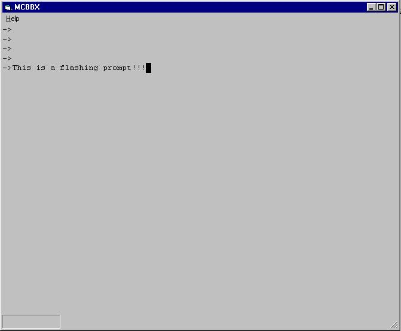



## A TRUE Windows Prompt Like Dos \(no controls\)

### Description

Haven't seen it done yet until I did it myself. I asked around if there was code to create a 'prompt' and all I seen was modifed multi-line boxes. This is not a Dos window, its a windows window. - this is as real as it gets...

If you need a GUI windows command prompt... here it is, Best WINDOWS command line code here...

Please: I am going to use this code for a Business Basic interpreter, if you find any bugs or make it better, please let me know!!! I am always looking for improvement here!! Code is FREE for all...
 
### More Info
 
See code

If you are looking to have a good command prompt in your WINDOWS application... here you are.

             |
---                |---
**Submitted On**   |2001-09-27 23:04:52
**By**             |[Mike Curry](https://github.com/Planet-Source-Code/PSCIndex/blob/master/ByAuthor/mike-curry.md)
**Level**          |Advanced
**User Rating**    |3.9 (67 globes from 17 users)
**Compatibility**  |VB 6\.0
**Category**       |[Files/ File Controls/ Input/ Output](https://github.com/Planet-Source-Code/PSCIndex/blob/master/ByCategory/files-file-controls-input-output__1-3.md)
**World**          |[Visual Basic](https://github.com/Planet-Source-Code/PSCIndex/blob/master/ByWorld/visual-basic.md)
**Archive File**   |[A TRUE Win270869272001\.zip](https://github.com/Planet-Source-Code/mike-curry-a-true-windows-prompt-like-dos-no-controls__1-27604/archive/master.zip)

### API Declarations

None, thank GOD!

